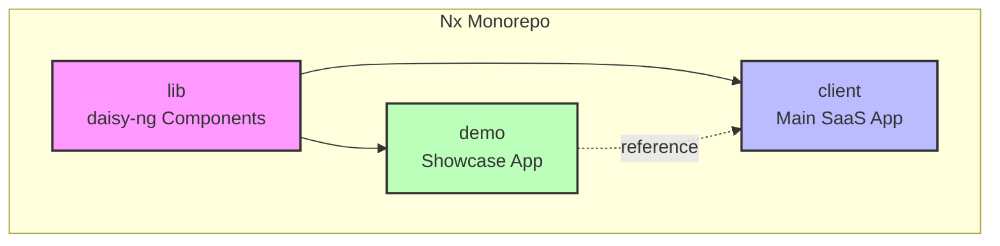

# 🚀 Duxsyn SaaS - Frontend Monorepo

> Modern SaaS platform built with Angular v20+ and Nx Monorepo architecture


---

## 📖 About

**Duxsyn SaaS** is a comprehensive frontend template for building enterprise-grade SaaS applications. It provides a multi-layout architecture, modular design, and reusable UI components, making it ideal for IoT platforms, dashboards, CMS, and internal systems.

### Key Features

- 🎭 **Multi-Layout System** - Landing, Auth, Main, Admin layouts
- 🧩 **Domain-Driven Architecture** - Modular and scalable
- 🌼 **daisy-ng Components** - Open-source Angular + DaisyUI library
- 📦 **Nx Monorepo** - Optimized workspace management
- 🎨 **Tailwind CSS + DaisyUI** - Modern utility-first styling
- 🔒 **Standalone Components** - Angular v20+ architecture
- 🛡️ **Type-Safe** - Full TypeScript coverage

---

## 🏗️ Monorepo Structure

This workspace contains three main projects:

```
projects/
├── client/   # 🎯 Main SaaS Application
├── lib/      # 🌼 Shared Component Library (daisy-ng)
└── demo/     # 🎪 Component Showcase & Testing
```

### Project Overview

| Project | Description | Tech Stack | Status |
|---------|-------------|------------|--------|
| **[client](./projects/client/README.md)** | Main SaaS application with multi-layout system | Angular 20+, Tailwind, DaisyUI | 🚧 In Development |
| **[lib](./projects/lib/README.md)** | `@daisy-ng/core` - Reusable Angular components | Angular 20+, DaisyUI | 🚧 In Development |
| **[demo](./projects/demo/README.md)** | Component playground and documentation | Angular 20+, Storybook-like | 📋 Planned |

### Dependency Graph



---

## 🚀 Quick Start

### Prerequisites

- **Node.js** >= 18.x
- **npm** >= 9.x
- **Nx CLI** (recommended)

```bash
npm install -g nx
```

### Installation

```bash
# Clone the repository
git clone <repository-url>
cd duxsyn-saas

# Install dependencies
npm install

# Start development server
nx serve client

# Open browser at http://localhost:4200
```

---

## 🛠️ Development Commands

### Serving Applications

```bash
# Serve main client application
nx serve client

# Serve demo/showcase application
nx serve demo

# Serve with specific port
nx serve client --port=4300
```

### Building

```bash
# Build client application
nx build client

# Build library for publishing
nx build lib

# Build all projects
nx run-many --target=build --all
```

### Testing

```bash
# Run tests for specific project
nx test client
nx test lib

# Run affected tests only
nx affected:test

# E2E testing
nx e2e client-e2e
```

### Code Quality

```bash
# Lint specific project
nx lint client

# Lint and auto-fix
nx lint client --fix

# Lint all projects
nx run-many --target=lint --all

# Format code
nx format:write
```

### Nx Utilities

```bash
# Visualize project dependencies
nx graph

# Show affected projects
nx affected:graph

# Clear Nx cache
nx reset

# Generate new component
nx g @nx/angular:component my-component --project=client
```

---

## 📂 Workspace Structure

```
duxsyn-saas/
├── projects/
│   ├── client/           # Main SaaS application
│   │   ├── src/
│   │   │   ├── app/
│   │   │   │   ├── core/
│   │   │   │   ├── layouts/
│   │   │   │   ├── modules/
│   │   │   │   ├── pages/
│   │   │   │   ├── shared/
│   │   │   │   └── configs/
│   │   │   ├── assets/
│   │   │   ├── styles.css
│   │   │   └── main.ts
│   │   └── project.json
│   │
│   ├── lib/              # daisy-ng component library
│   │   ├── src/
│   │   │   ├── components/
│   │   │   ├── directives/
│   │   │   ├── pipes/
│   │   │   └── public-api.ts
│   │   ├── README.md
│   │   └── package.json
│   │
│   └── demo/             # Component showcase
│       ├── src/
│       └── project.json
│
├── docs/                 # Documentation
│   ├── development-plan.md
│   ├── frontend-architecture.md
│   └── modules/
│
├── nx.json               # Nx workspace configuration
├── package.json          # Root dependencies
├── tailwind.config.js    # Tailwind configuration
└── tsconfig.base.json    # TypeScript base config
```

---

## 🎯 Development Roadmap

### Phase 1: Foundation ✅
- [x] Initialize Nx Workspace
- [x] Setup Angular 20+ with Vite
- [x] Configure Tailwind CSS + DaisyUI
- [x] Project structure design

### Phase 2: Layouts & Shell 🚧
- [ ] App Shell implementation
- [ ] Landing Layout
- [ ] Auth Layout
- [ ] Main Layout (Dashboard)
- [ ] Admin Layout

### Phase 3: Core Modules 📋
- [ ] Auth Module (Login, Register, Reset Password)
- [ ] User Module (Profile, Settings)
- [ ] Dashboard Module (Overview, Widgets)
- [ ] Admin Module (System Management)

### Phase 4: Integration & State 📋
- [ ] API Integration
- [ ] State Management (Signals/Store)
- [ ] Error Handling
- [ ] Layout Preloading

### Phase 5: Deployment 📋
- [ ] CI/CD Pipeline (GitHub Actions)
- [ ] Docker Configuration
- [ ] Testing Coverage
- [ ] Production Optimization

---

## 🌼 daisy-ng Library

The `lib/` project contains **daisy-ng**, an open-source Angular component library wrapping DaisyUI:

```typescript
import { DaisyButtonComponent, DaisyCardComponent } from '@daisy-ng/core';

@Component({
  standalone: true,
  imports: [DaisyButtonComponent, DaisyCardComponent],
  template: `
    <daisy-card>
      <h2>Welcome</h2>
      <daisy-button variant="primary">Get Started</daisy-button>
    </daisy-card>
  `
})
export class MyComponent {}
```

**Available Components:**
- ✅ Atoms: Button, Badge, Avatar, Chip, Icon
- 🚧 Molecules: Input, Checkbox, Radio, Toggle, Card
- 📋 Organisms: Modal, Drawer, Table, Dropdown, Navbar

[View full component documentation →](./projects/lib/README.md)

---

## 🎨 Styling & Theming

### Tailwind Configuration

```javascript
// tailwind.config.js
module.exports = {
  content: [
    './projects/client/src/**/*.{html,ts}',
    './projects/lib/src/**/*.{html,ts}',
  ],
  plugins: [require('daisyui')],
  daisyui: {
    themes: ['light', 'dark', 'cupcake', 'corporate'],
  },
}
```

### Component Prefixes

| Layer | Prefix | Example |
|-------|--------|---------|
| Pages | `page-` | `page-auth-login` |
| Layouts | `layout-` | `layout-main-header` |
| Shared | `dux-` | `dux-breadcrumb` |
| Library | `daisy-` | `daisy-button` |

---

## 📚 Documentation

- 📋 [Development Plan](./docs/development-plan.md)
- 🏗️ [Frontend Architecture](./docs/frontend-architecture.md)
- 🎯 [Client Application Guide](./projects/client/README.md)
- 🌼 [daisy-ng Component Library](./projects/lib/README.md)
- 📖 [API Integration](./docs/api/)
- 🔒 [Security Guidelines](./docs/security.md)

---

## 🤝 Contributing

We welcome contributions! Please follow these guidelines:

### Branch Strategy

```
main          # Stable production-ready code
develop       # Integration branch for features
feature/*     # New features
bugfix/*      # Bug fixes
release/*     # Release preparation
```

### Commit Convention

We follow [Conventional Commits](https://www.conventionalcommits.org/):

```bash
feat(client): add user profile page
fix(lib): resolve button disabled state
docs: update installation guide
style: format code with prettier
refactor(auth): simplify login flow
test(dashboard): add unit tests
chore: update dependencies
```

### Pull Request Process

1. Fork the repository
2. Create feature branch: `git checkout -b feature/my-feature`
3. Make changes and commit: `git commit -m 'feat: add my feature'`
4. Push to branch: `git push origin feature/my-feature`
5. Open Pull Request with description

---

## 🧪 Testing

### Test Structure

```bash
# Unit tests
nx test client
nx test lib

# Run all tests
nx run-many --target=test --all

# Test coverage
nx test client --coverage

# E2E tests
nx e2e client-e2e

# Watch mode
nx test client --watch
```

### Testing Guidelines

- Maintain > 80% code coverage
- Write tests for all public APIs
- Use OnPush change detection
- Mock external dependencies

---

## 🚢 Deployment

### Build for Production

```bash
# Build client application
nx build client --configuration=production

# Build output location
dist/client/
```

### Docker Support

```dockerfile
# Example Dockerfile (to be implemented)
FROM node:18-alpine
WORKDIR /app
COPY dist/client ./
RUN npm install -g http-server
CMD ["http-server", "-p", "80"]
```

### CI/CD Pipeline

```yaml
# .github/workflows/ci.yml (to be implemented)
name: CI
on: [push, pull_request]
jobs:
  build:
    runs-on: ubuntu-latest
    steps:
      - uses: actions/checkout@v3
      - run: npm install
      - run: nx affected:build --base=origin/main
      - run: nx affected:test --base=origin/main
```

---

## 📊 Project Status

| Module | Status | Progress |
|--------|--------|----------|
| Nx Workspace Setup | ✅ Complete | 100% |
| Tailwind + DaisyUI | ✅ Complete | 100% |
| daisy-ng Library | 🚧 In Progress | 30% |
| Client Architecture | 🚧 In Progress | 20% |
| Auth Module | 📋 Planned | 0% |
| Dashboard Module | 📋 Planned | 0% |
| Admin Module | 📋 Planned | 0% |
| CI/CD Pipeline | 📋 Planned | 0% |

---

## 🔗 Related Resources

- [Angular Documentation](https://angular.dev/)
- [Nx Documentation](https://nx.dev/)
- [Tailwind CSS](https://tailwindcss.com/)
- [DaisyUI](https://daisyui.com/)
- [TypeScript](https://www.typescriptlang.org/)

---

## 📧 Support

- **Issues**: [GitHub Issues](<repository-issues-url>)
- **Discussions**: [GitHub Discussions](<repository-discussions-url>)
- **Team Channel**: `#duxsyn-frontend`
- **Email**: support@duxsyn.dev

---

## 📄 License

This project is licensed under the MIT License - see the [LICENSE](LICENSE) file for details.

---

## 🙏 Acknowledgments

- Built with ❤️ using Angular and Nx
- UI powered by Tailwind CSS and DaisyUI
- Inspired by modern SaaS architectures

---

**🚀 Ready to build amazing SaaS applications!**