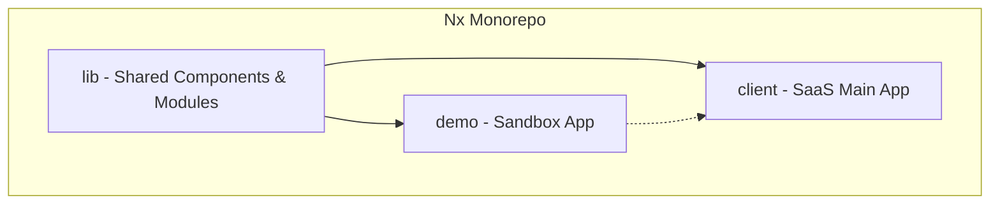
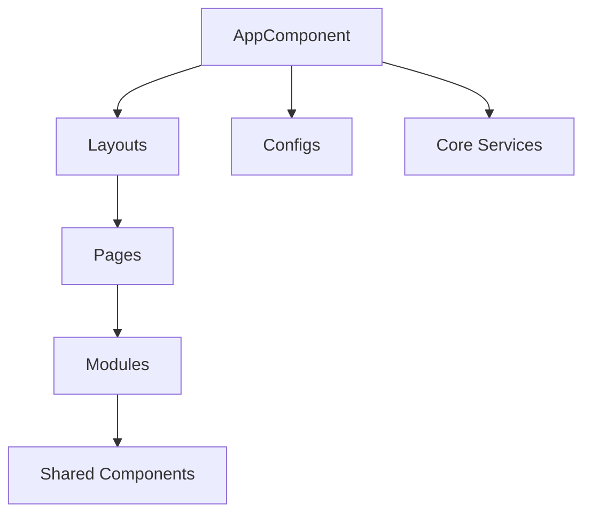

# 🧭 Duxsyn SaaS Development Plan

**Duxsyn SaaS** 是一個基於 **Angular v20+** 與 **Nx Monorepo** 架構所構建的 SaaS 前端模板。
專注於提供 **多 Layout、模組化、可擴充** 的開發骨架，適合作為中大型 Web 平台或企業內部系統的基礎框架。

後端環境採用 **Django + uv 管理**，支援 FastAPI 相容設計與容器化部署。
此專案目前作為模板工程，**不包含任何商業業務邏輯或品牌實作**。

---

## 🎯 專案定位

* 提供可重用的 SaaS 前端架構基底
* 支援多 Layout 模式（Landing / Auth / Main / Admin）
* 採用 Domain Module + Standalone Component 結構
* 適用於 IoT、Dashboard、CMS 等應用模板
* 採用 Nx Monorepo 組織，支援多專案共存與 library 封裝

---

## 🏗️ Architecture

本章說明 Duxsyn SaaS 的 Nx Monorepo 架構與主應用（client）的程式分層。

### 🧱 Monorepo Layout

整個 Duxsyn SaaS 採用 **Nx Monorepo 架構**，
包含三個主要 project，彼此可獨立開發或交叉依賴：

```
projects/
├── client/   # SaaS 主應用（核心前端模板）
├── lib/      # 共用 Library（UI 元件與模組封裝）
└── demo/     # 示範與測試環境（Playground / Library 預覽）
```

#### 📘 Monorepo Dependency Diagram



---

### 🧩 Client Structure

`client/` 是主要開發焦點，負責 App Shell、Routing、Layout 切換與 SaaS 業務整合。

```
src/app/
├─ core/        # 全域設定、守衛、攔截器
├─ layouts/     # App Shell 與多 Layout 容器
├─ modules/     # Domain 服務與資料邏輯層
├─ pages/       # 路由頁面與 UI 展示層
├─ shared/      # 共用元件、pipe、service
└─ configs/     # API entrypoint、環境設定、runtime config
```

#### 📘 Client Internal Architecture



> 🧠 此結構以 Angular v20+ Standalone Component 為核心，
> 並透過 AppComponent 統一管理 layout 切換與 模組 preload，
> 同時保持 Nx Monorepo 的模組獨立性與可封裝性。

---

## ⚙️ Development Plan

### 🧱 開發階段 (Milestones)

| 階段          | 目標                                                      | 時程                              | 狀態 |
| ----------- | ------------------------------------------------------- | ------------------------------- | -- |
| **Phase 1** | 初始化 Nx Workspace、Angular 20 環境、Tailwind/DaisyUI 設定      | *完成*                            | ✅  |
| **Phase 2** | 建立 App Shell 與 Layout 架構（Landing / Auth / Main / Admin） | yyyy/mm/dd — yyyy/mm/dd *(規劃中)* | ☐  |
| **Phase 3** | 實作主要 Modules 與 Pages（Auth / Main / Admin / Integration） |                                 | ☐  |
| **Phase 4** | 整合 API、預載入 Layout、錯誤頁與狀態管理 (Store / Signal)             |                                 | ☐  |
| **Phase 5** | CI/CD 流程、Docker 佈署、測試驗收                                 |                                 | ☐  |

---

### 🧩 模組與職責 (Modules Overview)

| 模組                 | 功能說明                                       | 優先級 | 狀態 |
| ------------------ | ------------------------------------------ | --- | -- |
| **Auth**           | 登入、註冊、重設密碼流程                               | 高   | ☐  |
| **User**           | 個人資料與帳號設定                                  | 高   | ☐  |
| **Dashboard**      | 使用者主控台總覽                                   | 高   | ☐  |
| **Admin**          | 系統管理與權限設定                                  | 中   | ☐  |
| **Integration**    | 外部系統整合 (API / MQTT / Webhook)              | 中   | ☐  |
| **Analytics**      | 數據分析與報表可視化                                 | 中   | ☐  |
| **System Monitor** | 系統健康狀態與即時監控                                | 中   | ☐  |
| **Audit Log**      | 操作稽核與事件追蹤模組（詳見 /docs/modules/audit-log.md） | 中   | ☐  |
| **Report**         | IoT / 能源報告生成與匯出                            | 低   | ☐  |
| **Notification**   | 系統事件與警示推送                                  | 低   | ☐  |

---

### 🧩 版本與分支策略 (Preliminary)

* **分支規範**：`main`（穩定版）｜`develop`（整合測試）｜`feature/*`（功能開發）
* **提交格式**：遵循 Conventional Commits，例如：`feat(audit-log): add user action logging service`
* **版本命名**：`v{major}.{minor}.{patch}-{env}`，例如：`v1.0.0-beta`
* **CI/CD 策略**：預計採用 GitHub Actions 為主要 pipeline，後續整合 Docker Compose 自動化佈署

---

## 🚀 Deployment & Testing

### 🧱 佈署環境 (Environments)

| 環境             | 說明                                   | 狀態 |
| -------------- | ------------------------------------ | -- |
| **Local**      | Nx workspace 開發環境，使用 Vite / ng serve | ✅  |
| **Staging**    | 預覽與測試環境，支援 Docker Compose            | ☐  |
| **Production** | 正式佈署環境，CI/CD 自動推送至容器平台               | ☐  |

---

### 🧩 測試矩陣 (Testing Matrix)

| 類型                   | 範圍                                  | 工具         | 狀態 |
| -------------------- | ----------------------------------- | ---------- | -- |
| **Unit Test**        | Service / Store / Utility           | Jest       | ☐  |
| **E2E Test**         | Routing / Layout / Flow 測試          | Cypress    | ☐  |
| **Integration Test** | API / State / Component Interaction | Playwright | ☐  |
| **Performance Test** | Lazy load / Preload / Rendering     | Lighthouse | ☐  |

> 所有測試任務將逐步整合至 Nx target 任務與 GitHub Actions workflow，確保一致性與自動化。

---
